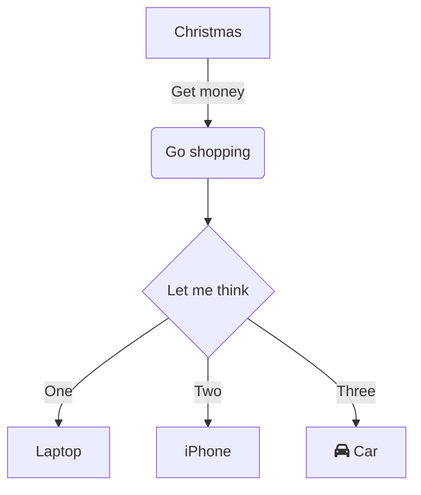

## Introduction
이 포스팅에서는 Chirpy Theme에서 jeykll의 방식을 이용해서 markdown언어로 어떻게 포스팅을 쓰면 될 지 알아보는 글이다.

### File Name & Path
Chirpy Theme에서 작성하는 모든 포스팅은 `_post`아래에 넣어주고 파일 형식은 `YYYY-MM-DD-TITLE.md` 형식으로 만들어서 넣어주면된다. `md`는 markdown의 줄임말이며 `.markdown`도 가능하다.
```plaintext
├── _posts
|   ├── YYYY-MM-DD-TITLE.md
|   ├── YYYY-MM-DD-TITLE.markdown
```

### Front Matter
다른 Jekyll은 모르겠으나 Chirpy Theme에서는 front matter라는 방식으로 아래와 같이 정의를 해아한다고 한다.

```yaml
---
title: TITLE
author: NAME
date: YYYY-MM-DD HH:MM:SS +/- TTTT
categories: [Blog, Chirpy]
tags: [chirpy, githubio]
pin: true
math: true
mermaid: true
toc: false
comments: false
image: 
    path: IMAGE_PATH
---
```

`title`, `author`는 당연히 글의 제목과 저자명을 넣으면 되는 것이니 패스하고, `date`에서는 년도-시간-표준시간 순서로 되어 있는데 한국에서 포스팅을 작성하는 경우 `+0900`을 쓰면 된다. 다른나라의 시간대는 [여기서](https://namu.wiki/w/%EC%8B%9C%EA%B0%84%EB%8C%80/%EA%B0%81%EA%B5%AD%EC%9D%98%20%EC%8B%9C%EA%B0%84%EB%8C%80) 확인해보면 된다.

- `categories`: Blog에 보면 HOME 아래버튼에 CATEGORIES라는 버튼이 있다. 여기에 어떻게 정렬을 할 것인지에 대한 내용이다. 새로운 카테고리를 만들고 싶다면 그냥 적어주면 새로운 카테고리에 쏙!하고 만들어진다.
- `tags`: 포스팅을 하다 보면 내가 원하는 keyword로 내 글을 인터넷에서 검색되게 하거나 내가 찾기 쉽게 정렬하고 싶은 경우가 있다. 그런 경우 `tags`에 적어주면 된다. 주의할 점은 여기는 **<u>소문자밖에 안되니 대문자를 적지말자</u>**.
- `pin`: 이 기능은 내가 포스팅을 올리면 HOME에서 상단에 고정시킬지 말지에 대한 유무이다. 나는 그냥 귀찮아서 다 pin하는데 만약 pin하고 싶은 포스트가 있다면 해당 포스팅에 이 인자를 넣어주고 `true`로 설정해주자.
- `math`: 웹페이지의 성능적 이유에서 mathematical 기능은 기본적으로 꺼놓았기 때문에 만약 포스팅에서 수학기호를 사용하고 싶다면 해당 인자를 넣어주고 `true`로 설정해주자.
- `mermaid`: 이 기능은 표 생성을 해주는 도구이다. 이 기능을 추가하면 아래와 같이 그래프코드를 감싸서 다른 마크다운 언어와 같이 사용할 수 있다. 만들고 싶으면 [이 페이지를](https://mermaid.live/edit#pako:eNpVkM1qw0AMhF9F6NRC_AI-FBq7zSWlhebmzUF45eyS7A_ymhBsv3vXNoVWJzHzjRAzYhs0Y4ndLdxbQ5LgVCsPeV6byojtk6P-DEXxMh04gQueHxPsnw4BehNitP7yvPH7BYJqPC4YQzLWX-fNqtb8p-cJ6uZIMYV4_uuc7mGCt8Z-mXz-v2OEc-q96ajsqGhJoCJZEdyhY3FkdX5_XBSFybBjhWVeNclVofJz5mhI4fvhWyyTDLzDIWpKXFu6CLlfkbVNQT62OtZW5h_iO1v9) 통해서 만들어 봐도 좋다.


- `image`: 만약 포스팅의 최상단에 이미지를 넣고 싶다면 `path`인자에 image의 위치를 넣어주면 이미지가 포스팅의 최상단에 뜨게 된다.
- `toc`: 이 기능은 Table of Contents로 포스팅의 오른쪽 패널에 위치하는 기능인데 모든 포스팅에 대해 이 기능을 끄고 포스팅을 하고 싶다면 `_config.yml` 파일에 가서 `toc`값을 `false`로 바꿔주면 된다.
- `comments`: 이 기능은 TOC와 비슷하게 각 포스팅마다 comments를 달 수 있다. 이 값은 `_config.yml` 파일의 `comments`값에 의해 결정이 나기때문에 바꾸고 싶은 사람들은 바꾸면 된다.


### Liguid Codes

```liquid
IF 

  This product's title contains the word Pack.

```
